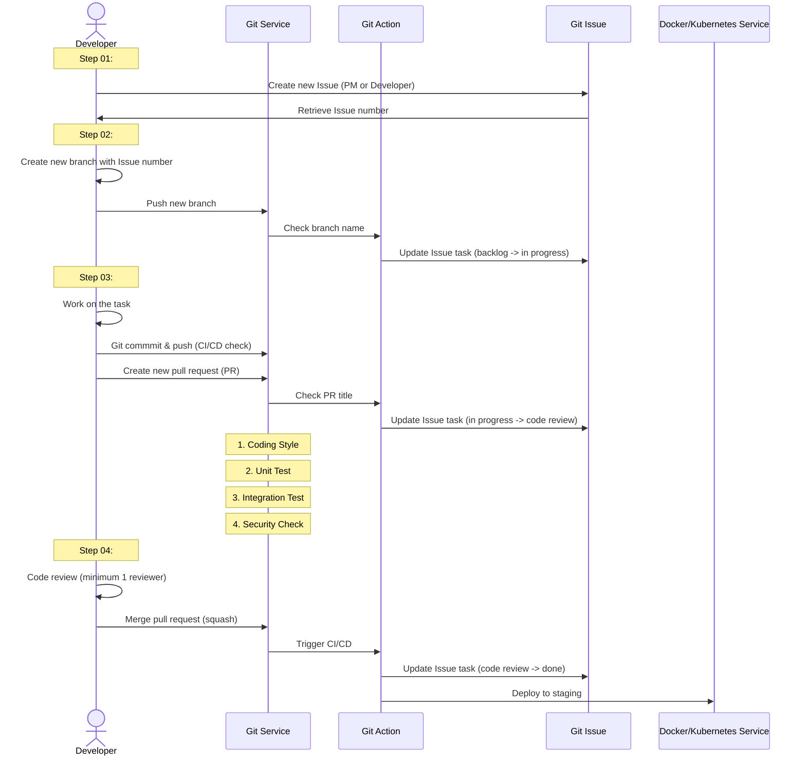

# Orient Telecoms Development Process

Orient Telecom's recommended development process.

## Git Tools

It is recommended to use the following Git tools:

- Visual Studio Code with Git extension
- LazyGit (can be used standalone, or integrated with Neovim)
- Git command line

## Software Development Process

This guide outlines the software development process for Orient Telecoms. It is
essential to ensure that the codebase is maintained based on a standard that is
agreed upon by the team

The guideline is not set in stone, and can be changed based on the team's agreement.
The steps mentioned here are mainly based on [GitHub flow][github_flow], and
slightly modified based on Orient Telecom's resources and requirements.



### 01. Git setup

Before starting to use Git for software development, set up Git with your name and
email address. This is important because every Git commit uses this information
to identify the author of the commit.

```bash
git config --global user.name "Full Name"
git config --global user.email "username@orient-telecoms.com"
```

### 02. Guidelines for creating a new repository

These are some key points when creating a new repository:

- The repository name should be descriptive and clearly convey its purpose.
- The `README.md` file should include a project description, installation instructions,
  and usage guidelines.
- The `LICENSE` file should contain the project's licensing information to ensure
  legal compliance.
- The `.gitignore` file should list files and directories to be ignored, preventing
  unnecessary files from being committed to the repository.
- Do not commit large binary files to the repository.
- Do not commit sensitive information such as passwords, API keys, or access tokens
  to the repository.
- Do not create repositories for personal projects on the company's Git instance.
- All repositories should be created as Private. Do not make the code public.

### 03. Software development workflow

#### 3.1. Branch management

Adopt [GitHub Flow][github_flow] as a guideline. The flow can be summarized as follows:

1. Create a new branch from `main`. Use Issue number as the name of the branch.
2. Make changes and commit them to the branch. Refer to 3.2 on commit message format.
3. Create a pull request (PR) to merge the branch into `main`. Code review is done
   here.
4. Address review comments.
5. Merge the PR using Squash Commit.
6. Delete your branch.

#### 3.2 Commit message

Commit messages should be brief and clearly describe the changes made.

Use the following texts to identify the type of changes:

- `feat`: New features or enhancements.
- `fix`: Bug fixes.
- `docs`: Documentation changes.
- `style`: Formatting.
- `refactor`: Refactoring.
- `test`: Testing.
- `chore`: Maintenance tasks.
Example: `feat(123): add-new-feature`. `123` refers to the Git issue number.

#### 3.3 Code review

At least 1 team member should review and approve the changes.
Use automated tests with Git Actions to ensure the code quality.
Squash Commit feature should be used to keep history clean and avoid unnecessary
merge commits.

#### 3.4 Version release

Use tags to mark important version points, e.g. `v1.0.0`.
Follow semantic versioning rules, with the format MAJOR.MINOR.PATCH.
Integrate Git Action with push and tag for automated deployment to staging and
production environments.

#### 3.5 Security

Do not include personal sensitive information in the codebase.

- Use `.env` files to store sensitive information.
- Add `.env` files to the `.gitignore` list.

Use Git Secrets for deployment-related sensitive information.

#### 3.6 Documentation

Developers should write detailed `README.md` files to guide future colleagues.
The documentation should include:

- Installation instructions
- Execution instructions
- Testing instructions
- Deployment instructions
- Usage instructions

#### 3.7 Code standards

Follow the team's agreed-upon code style guide to maintain code consistency. This
can be agreed on per project basis, and should be enforced using linters.

[github_flow]: https://docs.github.com/en/get-started/quickstart/github-flow
